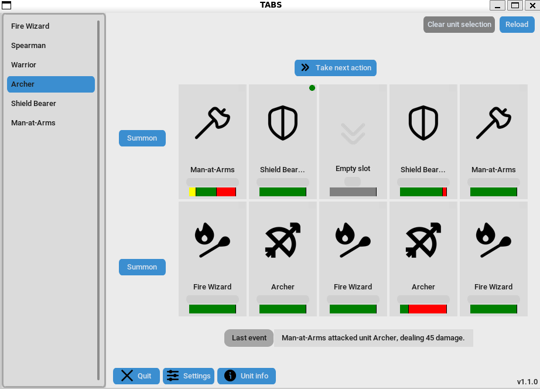
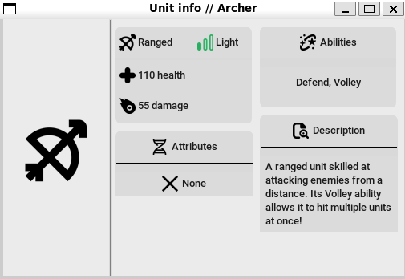

<h1 align="center"></h1>

**TABS** is a simulation tool/game, in which you pit various units against each other to fight! It's highly customizable, allowing anyone to add their own units and abilities which interact easily with the game.

I initially created this to help predict outcomes in turn-based games, but since then it's expanded way beyond it's scope!

## Getting started
 
> **TABS** is compatible with Windows and Linux. If you're running on Windows, I suggest you run TABS inside [WSL](https://learn.microsoft.com/en-us/windows/wsl/install), otherwise 
the UI might look weird. This is quite a large issue, as we have to define layouts specifically for both platforms, so it will take a while to fix.

1. **Clone** this repository ```git clone https://github.com/niilun/tabs.git``` or download it as an archive, and extract it.

2. Enter the repository folder in a terminal window and run TABS with ```py```/```python3```/```python``` ```main.py``` (you need to install [Python](https://www.python.org/downloads/)).

## Adding your own units

1. First, copy one of the examples already found in the ```units/``` folder set up the unit's name, class init method and stats.

    > **Note**: Units **MUST** have just about all the basic variables included in the example units' class definitions.

    > **Optional**: You can set a unit's own icon by registering it as an asset in ```assets/manifest.py```, and mapping it insiide ```unit_icons_map```.

2. Make sure the unit's class definition is decorated with ```@register_new_unit```, imported from the ```units``` module. This is needed for the game to register it.

3. Now, start TABS and your unit should now be listed!

**For more info, check the code documentation.**

## Building an executable

You can package the code into **executable form** using ```pyinstaller```. This still requires the ```assets``` folder to be present with the executable. You just need to run the build scripts from ```build_scripts/``` based on your platform.

> **Note**: due to how builds currently work, units cannot be changed after compile. If you wish to modify or add new units, you need to recompile.

## Screenshots

<h1 align="center"></h1>

<h1 align="center"></h1>

###### Screenshots captured while running inside WSL.

## Extra info / Acknowledgments

 - Logo made using the [Null](https://online-fonts.com/fonts/null) font (Made by Svetoslav Simov).

 - Some UI icons from [Uicons](https://www.flaticon.com/uicons) by Flaticon and [Mayor Icons](https://www.flaticon.com/authors/mayor-icons).

## License

This software is licensed under the [MIT License](https://en.wikipedia.org/wiki/MIT_License).
