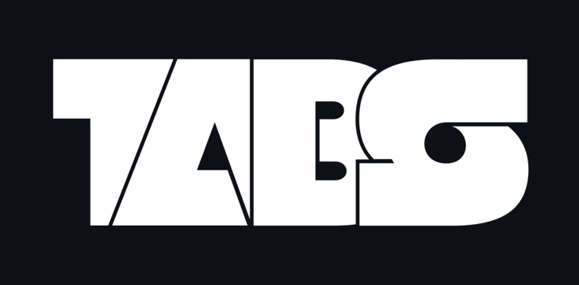

<h1 align="center"></h1>

**TABS** is a simulation tool/game, in which you pit various units against each other to fight! It's highly customizable, allowing anyone to add their own units and abilities which interact easily with the game.

I initially created this to help predict outcomes in turn-based games, but since then it's expanded way beyond it's scope!

## Getting started

1. **Clone** this repository ```git clone https://github.com/niilun/tabs.git``` or download it as an archive, and extract it.

2. Enter the repository folder in a terminal window and run TABS with ```py```/```python3```/```python``` ```main.py``` (you need to install [Python](https://www.python.org/downloads/)).

## Adding your own units

You need just a couple things to create a shiny new unit:

1. To work with the game, a unit needs to have
    - ```current_health```
    - ```max_health```
    - ```armor```
    - ```attack_damage```
in it's `__init__` method.

    > **Note**: Units can have ```attributes``` like *cavalry* or *melee* that other units can check against for special effects (ex. anti-cavalry deals more damage to cavalry)

    > **Optional**: You can set a unit's own icon by registering it as an asset in ```assets/manifest.py```, then linking that asset to the unit's ```asset_path``` variable.

2. Decorate the unit's class definition with ```@register_new_unit```, imported from the ```units``` module.

3. Now, start TABS and your unit should load automatically!

**For more info, check the code documentation.**

## Building an executable

You can package the code into **executable form** using ```pyinstaller```. However, you **still** need the ```assets``` folder present with the executable. You just need to run the build scripts from ```build_scripts/``` based on your platform.

## Extra info / Acknowledgments

Logo was made using the [Null](https://online-fonts.com/fonts/null) font (Made by Svetoslav Simov).

Some UI icons from [Uicons](https://www.flaticon.com/uicons) by Flaticon.

## License

This software is licensed under the [MIT License](https://en.wikipedia.org/wiki/MIT_License).
