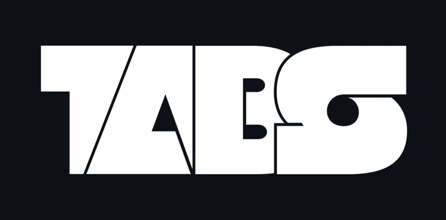

**TABS** is a simulation tool/game, in which you pit various units against each other to fight! It's highly customizable, allowing anyone to add their own units and abilities which interact easily with the game.

## Getting started

1. **Clone** this repository ```git clone https://github.com/Leowondeh/tabs.git``` or download it as an archive, and extract it.

2. Enter the repository folder in a terminal window.

2. Install library requirements if needed ```pip install -r requirements.txt```.

3. Run TABS with Python ```py```/```python3```/```python``` ```main.py```.

## Adding your own units

You need just a *couple* things to create a working, shiny new unit:

1. To work with the game, a unit needs to have 
    - ```current_health```
    - ```max_health```
    - ```armor```
    - ```attack_damage```
in it's `__init__` method.

> **Note**: The ```armor``` and ```max_health``` values are optional to use. Also, units can have ```attributes``` like *cavalry* or *melee* that other units can check against for special effects (stuff like anti-cavalry dealing more damage)

2. Check if the unit is imported to ```unit_management.py```.

3. Add the unit to ```all_units_map```.

**For more info, check the code documentation.**

## Building an executable

You can package the code into **executable form** using ```pyinstaller```. However, you **still** need the ```resources``` folder present with the executable.

1. If you don't have them installed already, run ```pip install -r requirements.txt``` to install all requirements.

2. Run the build scripts from ```build_scripts/```.

## To-do list

- [x] UI overhaul
- [ ] More units
- [ ] Interactions between units
- [ ] Stuff like status effects, attributes, etc.
- [ ] Boss-like template units

## Extra info / Acknowledgments

Logo was made using the [Null](https://www.fontfabric.com/fonts/null/#font-styles) font (Made by Svetoslav Simov).

Some icons from [Uicons](https://www.flaticon.com/uicons) by Flaticon.

## License

This software is licensed under the [MIT License](https://en.wikipedia.org/wiki/MIT_License).